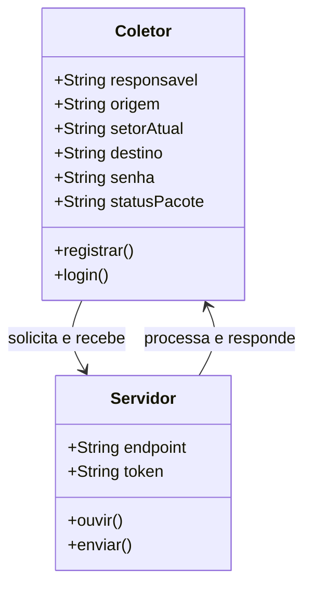

Aqui há o cruzamento de dados e criação do token de identificação do coletor. Aqui seria usado para segmentar os setores com base nos dados recebidos do servidor

```mermaid
classDiagram
    class Coletor {
        +String responsavel
        +String origem
        +String setorAtual
        +String destino
        +String senha
        +String statusPacote
        +registrar()
        +login()
    }

    class Servidor {
        +String endpoint
        +String token
        +ouvir()
        +enviar()
    }

    Coletor --> Servidor : solicita e recebe
    Servidor --> Coletor : processa e responde

```