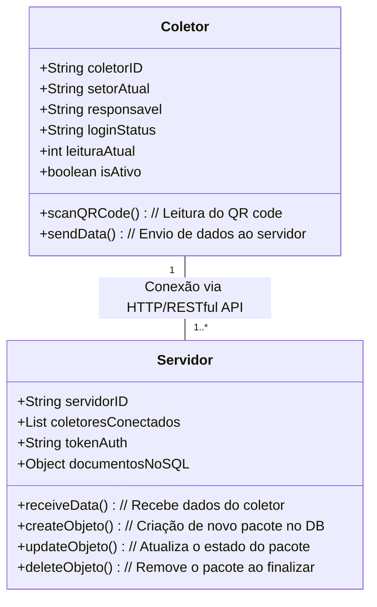
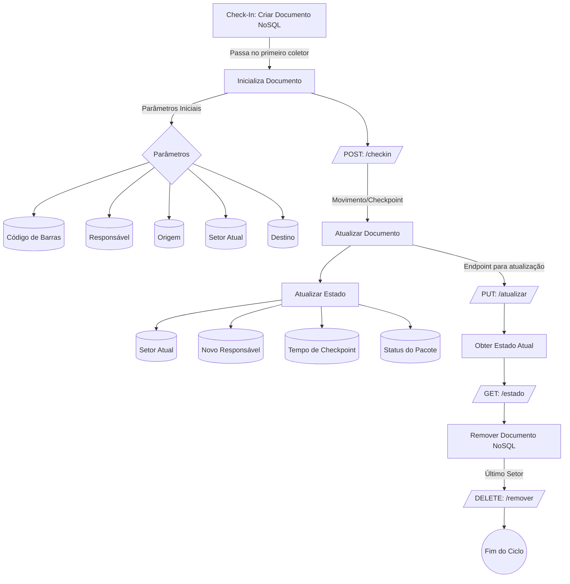

# Sistema de Gerenciamento Interno de Logística com WMS Implementado

## 1. Visão Geral do Projeto

Estou pensando em segmentar o projeto e indo criando as peças dele, enqunto você, meu jovem mancebo, tenta encaixa-las seguindo a ordem que mais lhes convém. Dado que é um portifólio, planejo configurar usando o SPT mesmo cada parte isolada para aprender como criar um projeto desse em multiplas fontes.
É tipo lego, monto a pessa, mas a criança que decide como vai encaixar.
O objetivo principal é granular a operação através de **tokens distribuídos** para os coletores por meio de um servidor. Quando um coletor lê um QR code, ele cria um objeto caso seja o primeiro checkpoint (`check-in`), realiza o overwriting do objeto ao longo do caminho e o deleta quando passa pelo último ponto (`check-out`).

## 2. Objetivo

O projeto busca implementar um **sistema de rastreio interno** que permita acompanhar o fluxo de pacotes entre setores de uma unidade logística. Isso será feito de forma a:

- Facilitar a criação e gestão de pacotes em um **banco de dados No-SQL**.
- Controlar atualizações do estado dos pacotes conforme passam por diferentes setores.
- Garantir a eliminação dos registros de pacotes quando saem da unidade, otimizando a utilização de recursos.

## 3. Requisitos de Implementação

A implementação é simples, uma vez que a única necessidade do cliente é ter **protocolos HTTP** para troca de informações e **acesso direto** à rede em que o servidor que está rodando a aplicação. A ideia é construir:

- Um site que rode como app nos coletores Android.
- Um ponto de acesso adicional para notebooks.

## 4. Funcionalidades Planejadas

### 4.1. Criação Automática de Pacotes
Ao identificar um novo pacote, o sistema cria um documento NoSQL e define as propriedades iniciais:

- Código de Barras
- Responsável Atual
- Origem
- Setor Atual
- Destino

### 4.2. Atualização de Localização e Setor
Cada coletor é capaz de atualizar o estado atual do pacote conforme ele avança pelo fluxo, utilizando um endpoint específico. Isso evita a necessidade de criar novos objetos para cada checkpoint.

### 4.3. Destruição de Pacotes
Quando o pacote atinge o último setor (check-out), o objeto correspondente é deletado do banco de dados. Isso reduz o armazenamento e otimiza a gestão de memória.

### 4.4. Planos Futuros
Penso  na possibilidade de implementar:

- Tratativas de erro com base em **modelos generativos de IA**.
- Um sistema de limpeza automática de documentos antigos para manter o banco de dados otimizado (uma rede neural baratinha)

---

## 5. Estrutura do Sistema

### 5.1. Diagrama de Classes

- Um coletor se conecta a um servidor, um servidos se conecta a n-coletores
### 5.2. Diagrama de Fluxo

## 6. Futuras Implementações

- **Tratativas de Erros Baseadas em IA**: Usar modelos generativos para identificar problemas no fluxo de pacotes.
- **Sistema de Limpeza de Documentos**: Automação para remover documentos obsoletos, garantindo que o banco de dados esteja sempre enxuto.

---

## 7. Contribuições
Caso tenha alguma ideia ou melhoria, entre em contato! Estamos abertos a sugestões (exceto às 3h da manhã, né? Não exagera! 😜).

## 8. Licença
Este projeto é licenciado sob a **MIT License**. Basicamente, você pode fazer o que quiser com isso, só não venha me processar. 😅
