# Sistema de Gerenciamento Interno de Logística com WMS Implementado

## 1. Visão Geral do Projeto

Estou pensando em segmentar o projeto e indo criando as peças dele, enqunto você, meu jovem mancebo, tenta encaixa-las seguindo a ordem que mais lhes convém. Dado que é um portifólio, planejo configurar usando o SPT mesmo cada parte isolada para aprender como criar um projeto desse em multiplas fontes.
É tipo lego, monto a pessa, mas a criança que decide como vai encaixar.
O objetivo principal é granular a operação através de **tokens distribuídos** para os coletores por meio de um servidor. Quando um coletor lê um QR code, ele cria um objeto caso seja o primeiro checkpoint (`check-in`), realiza o overwriting do objeto ao longo do caminho e o deleta quando passa pelo último ponto (`check-out`).

## 2. Objetivo

O projeto busca implementar um **sistema de rastreio interno** que permita acompanhar o fluxo de pacotes entre setores de uma unidade logística. Isso será feito de forma a:

- Facilitar a criação e gestão de pacotes em um **banco de dados No-SQL**.
- Controlar atualizações do estado dos pacotes conforme passam por diferentes setores.
- Garantir a eliminação dos registros de pacotes quando saem da unidade, otimizando a utilização de recursos.

## 3. Requisitos de Implementação

A implementação é simples, uma vez que a única necessidade do cliente é ter **protocolos HTTP** para troca de informações e **acesso direto** à rede em que o servidor que está rodando a aplicação. A ideia é construir:

- Um site que rode como app nos coletores Android.
- Um ponto de acesso adicional para notebooks.

## 4. Funcionalidades Planejadas

### 4.1. Criação Automática de Pacotes
Ao identificar um novo pacote, o sistema cria um documento NoSQL e define as propriedades iniciais:

- Código de Barras
- Responsável Atual
- Origem
- Setor Atual
- Destino

### 4.2. Atualização de Localização e Setor
Cada coletor é capaz de atualizar o estado atual do pacote conforme ele avança pelo fluxo, utilizando um endpoint específico. Isso evita a necessidade de criar novos objetos para cada checkpoint.

### 4.3. Destruição de Pacotes
Quando o pacote atinge o último setor (check-out), o objeto correspondente é deletado do banco de dados. Isso reduz o armazenamento e otimiza a gestão de memória.

### 4.4. Planos Futuros
Penso  na possibilidade de implementar:

- Tratativas de erro com base em **modelos generativos de IA**.
- Um sistema de limpeza automática de documentos antigos para manter o banco de dados otimizado (uma rede neural baratinha)

---

## 5. Estrutura do Sistema

### 5.1. Diagrama de Classes

```mermaid
classDiagram
    class Coletor {
        +String coletorID
        +String setorAtual
        +String responsavel
        +String loginStatus
        +int leituraAtual
        +boolean isAtivo
        +scanQRCode() // Leitura do QR code
        +sendData() // Envio de dados ao servidor
    }

    class Servidor {
        +String servidorID
        +List coletoresConectados
        +String tokenAuth
        +Object documentosNoSQL
        +receiveData() // Recebe dados do coletor
        +createObjeto() // Criação de novo pacote no DB
        +updateObjeto() // Atualiza o estado do pacote
        +deleteObjeto() // Remove o pacote ao finalizar
    }

    Coletor "1" -- "1..*" Servidor: Conexão via HTTP/RESTful API
```

- Um coletor se conecta a um servidor, um servidos se conecta a n-coletores
### 5.2. Diagrama de Fluxo

```mermaid
graph TD
  A[Check-In: Criar Documento NoSQL] -->|Passa no primeiro coletor| B[Inicializa Documento]
  
  B -->|Parâmetros Iniciais| C{Parâmetros}
  C --> C1[(Código de Barras)]
  C --> C2[(Responsável)]
  C --> C3[(Origem)]
  C --> C4[(Setor Atual)]
  C --> C5[(Destino)]

  B --> D[/POST: /checkin/]

  D -->|Movimento/Checkpoint| E[Atualizar Documento]
  E -->|Endpoint para atualização| F[/PUT: /atualizar/]

  E --> G[Atualizar Estado]
  G --> G1[(Setor Atual)]
  G --> G2[(Novo Responsável)]
  G --> G3[(Tempo de Checkpoint)]
  G --> G4[(Status do Pacote)]

  F --> H[Obter Estado Atual]
  H --> I[/GET: /estado/]

  I --> J[Remover Documento NoSQL]
  J -->|Último Setor| K[/DELETE: /remover/]

  K --> L((Fim do Ciclo))
```

## 6. Futuras Implementações

- **Tratativas de Erros Baseadas em IA**: Usar modelos generativos para identificar problemas no fluxo de pacotes.
- **Sistema de Limpeza de Documentos**: Automação para remover documentos obsoletos, garantindo que o banco de dados esteja sempre enxuto.

---

## 7. Contribuições
Caso tenha alguma ideia ou melhoria, entre em contato! Estamos abertos a sugestões (exceto às 3h da manhã, né? Não exagera! 😜).

## 8. Licença
Este projeto é licenciado sob a **MIT License**. Basicamente, você pode fazer o que quiser com isso, só não venha me processar. 😅
